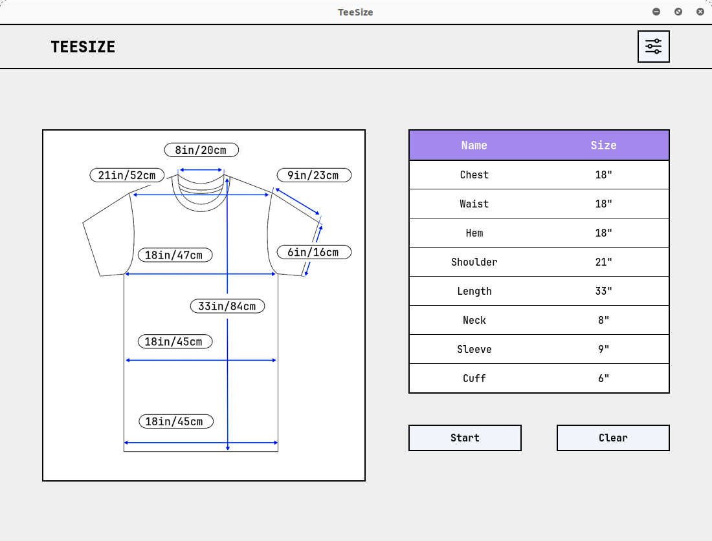
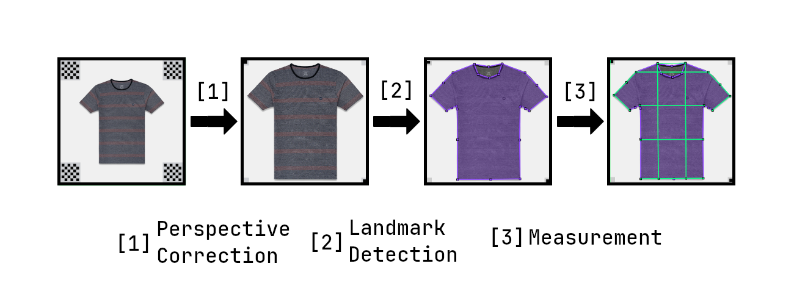
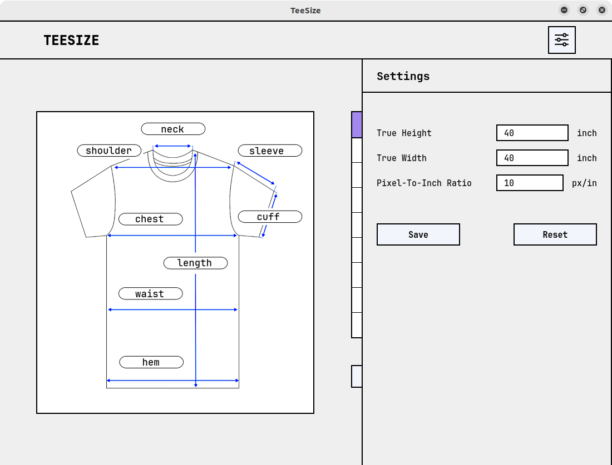

# TeeSize

Automatic measurement of T-shirt sizes using deep learning



## Introduction

TeeSize uses a model trained on a subset of the DeepFashion2 dataset to detect landmarks on T-shirt images. It then uses these landmarks to compute the following sizes of a T-shirt: *chest, waist, hem, shoulder, length, neck, sleeve, and cuff*.

In order to accurately measure the sizes in imperial units (inches), the T-shirt image must have [chessboard patterns](assets/chessboard.png) in all four corners. The program uses the true width and the true height between these chessboard patterns to perform perspective correction and to determine the pixel-to-inch ratio.

An overview of this process is shown in the diagram below:



## Requirements

The application requires a Python environment with the following packages installed:

- imgaug
- matplotlib
- numpy
- opencv-python
- Pillow
- prettytable
- PyQt5
- segmentation_models_pytorch
- skimage
- torch
- torchsummary
- tqdm

These packages can be installed by running the following command:

```sh
pip install -r requirements.txt
```

## Usage

To launch the application, run the following command:

```sh
python app.py --mode gui --checkpoint path/to/model.pth
```

The following optional arguments are available:

- `--checkpoint`: The model weights to use for loading the model
- `--truewidth`: Default value for the true width between chessboard patterns (in inches)
- `--trueheight`: Default value for the true height between chessboard patterns (in inches)
- `--pixeltoinch`: Number of pixels that should represent one inch in the perspective corrected image
- `--margin`: Number of pixels by which to trim the perspective corrected image from each side

Note: The `--pixeltoinch` argument is purely cosmetic, it is only used to determine the size of the perspective corrected image, and is not used in any size calculation. The size calculation depend on the `--truewidth` and `--trueheight` arguments.

The arguments (`--truewidth`, `--trueheight`, and `--pixeltoinch`) only define the default values for convenience. They can be modified in the application settings.




## Training the Model

The model is trained on a subset of the DeepFashion2 dataset. To train the model, download the [DeepFashion2](https://github.com/switchablenorms/DeepFashion2) dataset in the `data/` folder. Rename the validation folder to test folder (the test images provided by DeepFashion2 are not annotated, so we can not use it for our purposes), and prepare the following folder structure.

```txt
data
├── deepfashion2
│   ├── train
│   │   ├── annotations
│   │   └── images
│   └── test
│       ├── annotations
│       └── images
├── process.py
└── visualize.py
```
The DeepFashion2 is an aggregate of many types of clothing items in all sorts of conditions, so we perform the following steps:

1. Extract only those images (and their corresponding annotation files) that have short sleeve shirts.
2. Crop these images to the bounding box of the short sleeve shirts.
3. Remove invalid images (and their corresponding annotation files). An image is invalid if:
   - some of its landmarks are invisible,
   - some landmarks are outside the image bounds,
   - it is smaller than 224 pixels or larger than 960 pixels, or
   - its width is larger than 640 pixels.
4. And adjust annotation files so everything works correctly.

These steps are automatically performed by running the following command inside the `data/` directory:

```sh
python process.py
```

To ensure that everything is working correctly, you can run the following command to verify that the landmarks appear in the correct positions.

```sh
python visualize.py 500 # or any other image number
```

Once the dataset is prepared, go into the root folder (where the `app.py` is located) and run the following command:

```sh
python app.py --mode train --dataset path/to/train_dataset
```

Optionally, you can fine-tune the model instead of training it from scratch, by providing a checkpoint file.

```sh
python app.py --mode train --dataset path/to/train_dataset --checkpoint path/to/checkpoint.pth
```

The program saves the model weights after every epoch in the `lib/checkpoints/` folder. This allows to resume training in case the training takes too long or an error is encountered.


To test the model, run the following command. This creates a model summary and evaluates the model using the percentage of correct keypoints (PCK) criteria, and saves the results in the `lib/res` folder. The threshold value is in pixels and is used in the PCK computation. A keypoint is considered a correct keypoint if the distance between the ground truth keypoint and the predicted keypoint is not larger than this threshold.

```sh
python app.py --mode test --dataset path/to/test_dataset --checkpoint path/to/model.pth --threshold 25
```

## Acknowledgements

This project was inspired by the paper: [Contour Hugging Heatmaps for Landmark Detection](https://doi.org/10.1109/CVPR52688.2022.01994) by J. McCouat and I. Voiculescu.

This project uses the JetBrains Mono font.

```txt
Copyright 2020 The JetBrains Mono Project Authors (https://github.com/JetBrains/JetBrainsMono). 

This Font Software is licensed under the SIL Open Font License, Version 1.1.
```

This project uses the following icons:
- <a href="https://www.freepik.com/icon/hawaiian-shirt_4789887">Icon by Freepik</a>
- <a href="https://www.flaticon.com/free-icons/settings" title="settings icons">Settings icons created by dmitri13 - Flaticon</a>

---